[](https://docs.khulnasoft.com/packetstreamer)
[](https://github.com/khulnasoft-lab/PacketStreamer/blob/master/LICENSE)
[](https://github.com/khulnasoft-lab/PacketStreamer/stargazers)
[](https://github.com/khulnasoft-lab/PacketStreamer/issues)
[](https://github.com/khulnasoft-lab/PacketStreamer/issues)
[](https://join.slack.com/t/khulnasoft/shared_invite/zt-podmzle9-5X~qYx8wMaLt9bGWwkSdgQ)

# PacketStreamer

Khulnasoft PacketStreamer is a high-performance remote packet capture and
collection tool. It is used by Khulnasoft's [ThreatStryker](https://khulnasoft.com/threatstryker/)
security observability platform to gather network traffic on demand from cloud
workloads for forensic analysis.

Primary design goals:

* Stay light, capture and stream, no additional processing
* Portability, works across **virtual machines, Kubernetes and AWS Fargate**. Linux
  and Windows

PacketStreamer **sensors** are started on the target servers. Sensors capture
traffic, apply filters, and then stream the traffic to a central receiver.
Traffic streams may be compressed and/or encrypted using TLS.

The PacketStreamer **receiver** accepts PacketStreamer streams from multiple
remote sensors, and writes the packets to a local `pcap` capture file

<p align="center"><p>

PacketStreamer sensors collect raw network packets on remote hosts. It selects packets
to capture using a BPF filter, and forwards them to a central receiver process
where they are written in pcap format.  Sensors are very lightweight and impose
little performance impact on the remote hosts. PacketStreamer sensors can be
run on bare-metal servers, on Docker hosts, and on Kubernetes nodes.

The PacketStreamer receiver accepts network traffic from multiple sensors,
collecting it into a single, central `pcap` file.  You can then process the 
pcap file or live feed the traffic to the tooling of your choice, such as
`Zeek`, `Wireshark` `Suricata`, or as a live stream for Machine Learning models.

## When to use PacketStreamer

PacketStreamer meets more general use cases than existing alternatives. For
example , Use PacketStreamer if you need a lightweight, efficient method to collect raw
network data from multiple machines for central logging and analysis.

## Quick Start



For full instructions, refer to the [PacketStreamer Documentation](https://docs.khulnasoft.com/packetstreamer/).

You will need to install the golang toolchain and `libpcap-dev` before building PacketStreamer.
  
```shell script
# Pre-requisites (Ubuntu): sudo apt install golang-go libpcap-dev
git clone https://github.com/khulnasoft-lab/PacketStreamer.git
cd PacketStreamer/
make
```

Run a PacketStreamer receiver, listening on port **8081** and writing pcap output to **/tmp/dump_file** (see [receiver.yaml](contrib/config/receiver.yaml)):
  
```shell script
./packetstreamer receiver --config ./contrib/config/receiver.yaml
```

Run one or more PacketStreamer sensors on local and remote hosts. Edit the **server address** in [sensor.yaml](contrib/config/sensor-local.yaml):

```shell script
# run on the target hosts to capture and forward traffic

# copy and edit the sample sensor-local.yaml file, and add the address of the receiver host
cp ./contrib/config/sensor-local.yaml ./contrib/config/sensor.yaml

./packetstreamer sensor --config ./contrib/config/sensor.yaml
```

  
## Who uses PacketStreamer?

 * Khulnasoft [ThreatStryker](https://khulnasoft.com/threatstryker/) uses
   PacketStreamer to capture traffic from production platforms for forensics
   and anomaly detection.

## Get in touch

Thank you for using PacketStreamer.

 * [](https://docs.khulnasoft.com/packetstreamer/) Start with the documentation
 * [](https://join.slack.com/t/khulnasoft/shared_invite/zt-podmzle9-5X~qYx8wMaLt9bGWwkSdgQ) Got a question, need some help?  Find the Khulnasoft team on Slack
 * [](https://github.com/khulnasoft-lab/PacketStreamer/issues) Got a feature request or found a bug? Raise an issue
 * [productsecurity *at* khulnasoft *dot* io](SECURITY.md): Found a security issue? Share it in confidence
 * Find out more at [khulnasoft.com](https://khulnasoft.com/)

## Security and Support

For any security-related issues in the PacketStreamer project, contact [productsecurity *at* khulnasoft *dot* io](SECURITY.md).

Please file GitHub issues as needed, and join the Khulnasoft Community [Slack channel](https://join.slack.com/t/khulnasoft/shared_invite/zt-podmzle9-5X~qYx8wMaLt9bGWwkSdgQ).

## License

The Khulnasoft PacketStreamer project (this repository) is offered under the [Apache2 license](https://www.apache.org/licenses/LICENSE-2.0).

[Contributions](CONTRIBUTING.md) to Khulnasoft PacketStreamer project are similarly accepted under the Apache2 license, as per [GitHub's inbound=outbound policy](https://docs.github.com/en/github/site-policy/github-terms-of-service#6-contributions-under-repository-license).
